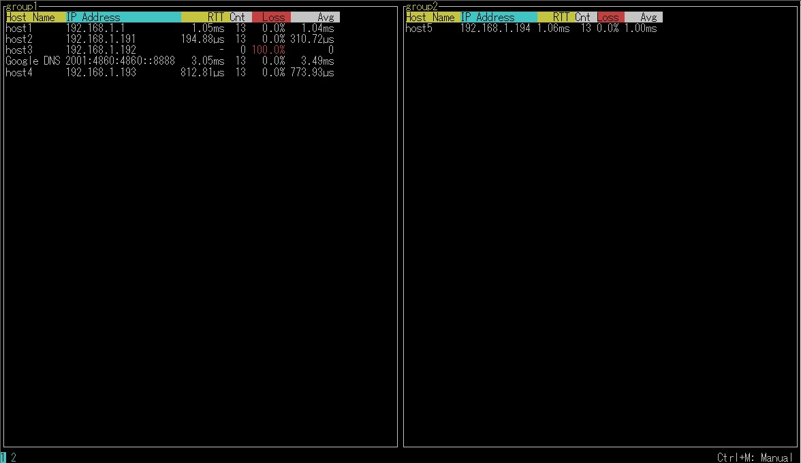

GoMPing
==== 
This is a tool I created for studying Golang.



## Description
This is a parallel pinging tool for Linux/MAC.
It's very easy to use because it has only minimal features.

## Usage
Please edit the configuration.
```shell
vi ./gomping.json
```

and execute gomping.(need root permission)
```shell
sudo gomping
```

## Install
Just download it and unzip it.

## Licence
GoMPing is [MIT](https://github.com/tcnksm/tool/blob/master/LICENCE)

## Author
[knhk](https://github.com/knhk)
